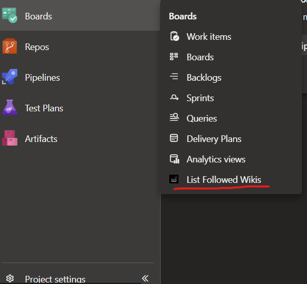
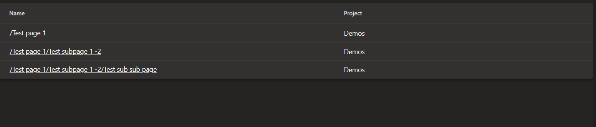

# Azure DevOps Wiki Extension

## Overview

The Azure DevOps Wiki Extension is a powerful tool designed to help you manage and access all the wikis you have followed within your Azure DevOps environment. This extension provides a centralized view of your followed wikis, making it easier to stay organized and up-to-date with the latest information.

## Features

- **Centralized Wiki Management**: View all your followed wikis in one place.
- **Quick Access**: Easily navigate to any of your followed wikis with a single click.
- **User-Friendly Interface**: Intuitive and easy-to-use interface for seamless navigation.

## Installation

To install the Azure DevOps Wiki Extension, follow these steps:

1. Navigate to the [Visual Studio Marketplace](https://marketplace.visualstudio.com/).
2. Search for "List Followed Wikis".
3. Click on the extension and select "Install".

## Usage

Once installed, you can access the extension from the Azure DevOps Boards -> List Followed Wiki. The extension will display a list of all the wikis you have followed, allowing you to quickly access and manage them.

## Screenshot

## Support

For any issues or feature requests, please visit our [GitHub repository](https://github.com/akshaybheda/azure-devops-wiki-extension) and create an issue. We welcome contributions and feedback from the community.

## License

This project is licensed under the MIT License. See the [LICENSE](LICENSE) file for more details.
